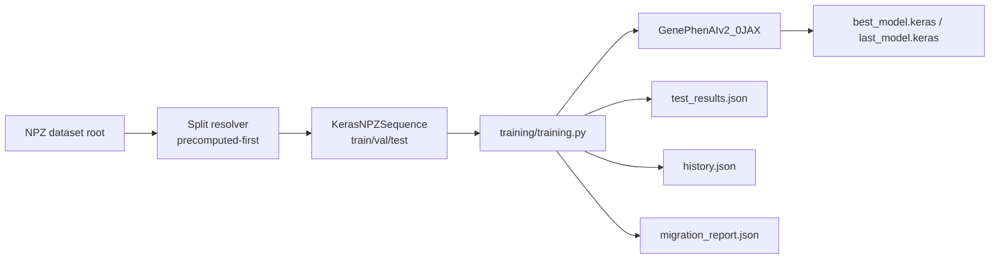

# Training with Keras + JAX

This document describes the current training stack: Keras 3 + JAX on NPZ graph shards.

## Scope

- `training/training.py` as Keras/JAX trainer.
- NPZ dataset consumption (`manifest.json`, `shards/*.npz`, `.npy` splits).
- v2.0 model architecture.
- `.keras` checkpointing and resume support.

## Data Flow



## Core Modules

- `training/training.py`
  - Main Keras/JAX training entrypoint.
  - Compiles model with AdamW + sparse CE (from logits).
  - Computes MRR + Top-K metrics for validation/testing.

- `training/datasets/keras_npz_sequence.py`
  - Precomputed-first split resolver for `.npy` indices.
  - Deterministic fallback split generation.
  - Keras Sequence adapter around NPZ shard dataset.

- `training/models/keras_layers.py`
  - `MaskedGCNLayer`: message passing with edge-index + masks.
  - `MaskedAttentionalPooling`: masked node-attention pooling.

- `training/models/keras_models.py`
  - `GenePhenAIv2_0JAX` factory and custom object registry.

- `training/migration_report.py`
  - Writes run metadata and artifact format summary.

## Format Contract

- Dataset backend:
  - NPZ shards + manifest.

- Splits:
  - `train_indices.npy`, `val_indices.npy`, `test_indices.npy`.

- Checkpoints:
  - `best_model.keras`, `last_model.keras`, `last_model.state.json`.

- CLI:
  - Added `--write_random_splits`, `--jit_compile`.

- Model versions:
  - Trainer currently supports `2.0` only.

## Requirements

- Keras backend must be JAX: `KERAS_BACKEND=jax`
- Install stack via:
  - `requirements-jax-cpu.txt` or
  - `requirements-jax-cuda12.txt`

## Example Commands

Train:

```bash
KERAS_BACKEND=jax python -m training.training \
  --dataset_root data/simulation/output_jax_npz \
  --output_dir training_output_jax \
  --model_version 2.0 \
  --epochs 20 \
  --batch_size 64
```

Resume:

```bash
KERAS_BACKEND=jax python -m training.training \
  --dataset_root data/simulation/output_jax_npz \
  --output_dir training_output_jax \
  --resume_from_checkpoint training_output_jax/last_model.keras \
  --epochs 30
```
