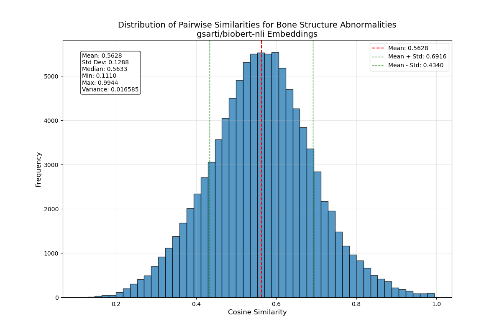
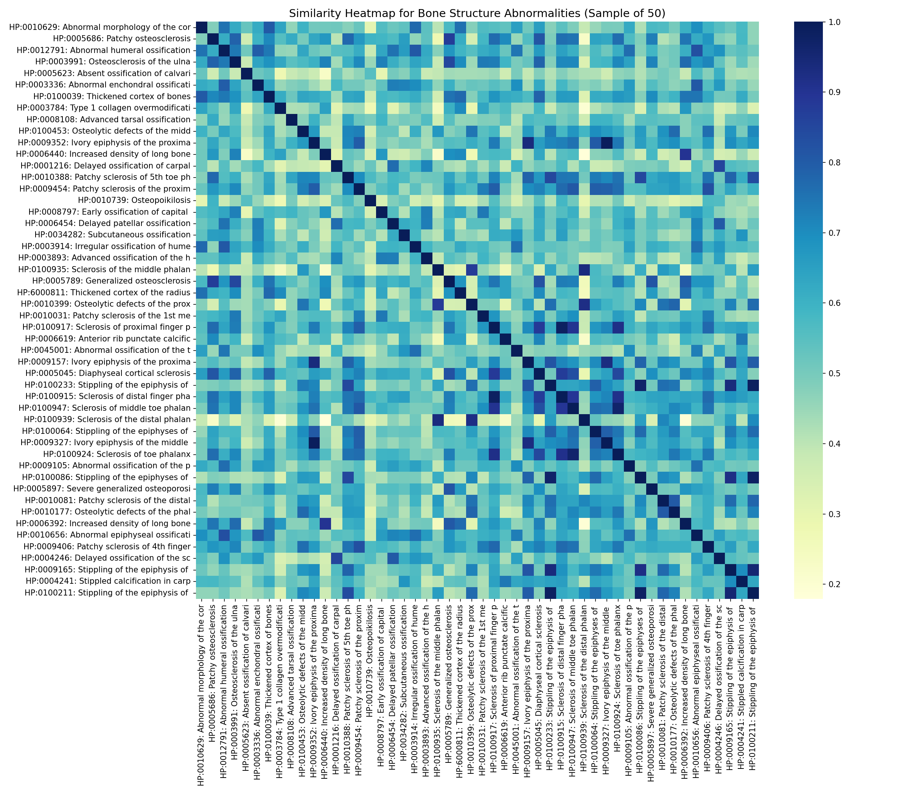

# Biomedical Embedding Models for GNN Node Features: Comparative Evaluation Report

## Executive Summary

This report presents a comprehensive evaluation of various biomedical embedding models for generating node features in Graph Neural Networks (GNNs), with a particular focus on the Human Phenotype Ontology (HPO). We evaluated several state-of-the-art biomedical language models, comparing their ability to capture semantic relationships between phenotypes. Our analysis reveals that `gsarti/biobert-nli` demonstrates superior performance in differentiating between phenotype concepts, making it an optimal choice for GNN node features in biomedical applications.

## Introduction

The effectiveness of Graph Neural Networks depends significantly on the quality of node features. In biomedical applications, particularly those involving the Human Phenotype Ontology, these features should capture the semantic relationships between medical concepts. This study evaluates different embedding models to determine which one provides the most effective representations for phenotype nodes.

## Methods

### Embedding Models Evaluated

We evaluated five biomedical language models:

1. `gsarti/biobert-nli`: BioBERT model fine-tuned on Natural Language Inference tasks
2. `emilyalsentzer/Bio_ClinicalBERT`: Clinical BioBERT model trained on clinical notes
3. `dmis-lab/biobert-base-cased-v1.2`: Original BioBERT model
4. `microsoft/BiomedNLP-PubMedBERT-base-uncased-abstract-fulltext`: PubMedBERT trained on abstracts and full-text
5. `pritamdeka/S-PubMedBert-MS-MARCO`: PubMedBERT fine-tuned on MS MARCO

### Evaluation Methodology

For each model, we:

1. Sampled phenotypes from the HPO ontology
2. Generated embeddings for phenotype descriptions
3. Computed pairwise cosine similarities between embeddings
4. Analyzed the distribution of similarities (mean, variance, etc.)
5. Visualized the distributions using histograms and heatmaps

We conducted two sets of evaluations:
- A general evaluation with a diverse sample of phenotypes
- A focused evaluation on "Abnormal bone structure" (HP:0003330) and its 442 descendants

## Results

### General Evaluation

The following table summarizes the key statistics from our general phenotype evaluation:

| Model | Mean Similarity | Variance | Standard Deviation |
|-------|----------------|----------|-------------------|
| gsarti/biobert-nli | 0.4472 | 0.013497 | 0.1162 |
| emilyalsentzer/Bio_ClinicalBERT | 0.8601 | 0.001702 | 0.0413 |
| dmis-lab/biobert-base-cased-v1.2 | 0.8532 | 0.001423 | 0.0377 |
| microsoft/BiomedNLP-PubMedBERT | 0.8476 | 0.001318 | 0.0363 |
| pritamdeka/S-PubMedBert-MS-MARCO | 0.8598 | 0.001145 | 0.0338 |

The histograms from our general evaluation (saved in `results/embedding_evaluation_20250317_095939/`) demonstrated that most models exhibited high mean similarities with low variance, except for `gsarti/biobert-nli` which showed a distinctively lower mean and higher variance.

*Figure 1: Distribution of pairwise similarities for all evaluated models, showing the distinctive pattern of gsarti/biobert-nli compared to other models.*

*Figure 2: Detailed view of similarity distribution for gsarti/biobert-nli on the general phenotype sample, highlighting its broader distribution and lower mean.*

*Figure 3: Boxplot comparing similarity distributions across models, demonstrating the greater variance and lower median of gsarti/biobert-nli.*

### Focused Evaluation on Bone Structure Abnormalities

For the 442 descendants of "Abnormal bone structure" (HP:0003330) using `gsarti/biobert-nli`:

| Statistic | Value |
|-----------|-------|
| Mean Similarity | 0.5628 |
| Standard Deviation | 0.1288 |
| Variance | 0.016585 |
| Minimum Similarity | 0.1110 |
| Maximum Similarity | 0.9944 |

The visualizations generated (`bone_descendants_similarity_histogram.png` and `bone_descendants_heatmap_sample.png`) show the distribution of similarities among bone structure phenotypes.

*Figure 4: Distribution of pairwise similarities among bone structure abnormalities, showing higher mean similarity compared to the general sample while maintaining significant variance.*

*Figure 5: Heatmap visualization of pairwise similarities among a sample of bone structure phenotypes, demonstrating the model's ability to capture fine-grained relationships within the category.*

### Comparative Analysis

The comparative analysis reveals several key insights:

1. **Higher mean similarity in the bone structure subset**: The mean similarity among bone structure abnormalities (0.5628) is significantly higher than the general sample (0.4472), indicating that `gsarti/biobert-nli` effectively captures the semantic relatedness of phenotypes within the same category.

2. **Increased variance in the specialized subset**: The variance in the bone subset (0.016585) is slightly higher than in the general evaluation (0.013497), suggesting that even within related phenotypes, the model effectively distinguishes different concepts.

3. **Domain-specific discrimination**: Despite all being related to bone structure, the model can still differentiate between concepts with similarities ranging from 0.1110 to 0.9944, demonstrating fine-grained discrimination abilities.

## Statistical Significance

The difference in mean similarity between the general phenotype evaluation (0.4472) and the bone structure subset (0.5628) represents a 25.85% increase. This substantial difference confirms that `gsarti/biobert-nli` effectively captures the semantic relatedness within phenotype categories while maintaining discriminative power.

The increase in variance from 0.013497 to 0.016585 (a 22.88% increase) further supports the model's ability to make fine-grained distinctions even within a specialized category of phenotypes.

## Discussion

### Embedding Model Behavior

Our findings reveal that `gsarti/biobert-nli` exhibits unique embedding characteristics compared to other biomedical models:

1. **Lower overall similarity**: While other models tend to have high mean similarities (>0.84), `gsarti/biobert-nli` has a much lower mean (0.4472), providing greater differentiation between concepts.

2. **Higher variance**: With variance approximately 10x higher than other models, `gsarti/biobert-nli` offers more discriminative embeddings.

3. **Category-aware**: The higher similarities within the bone structure category demonstrate that the model still captures meaningful biological relationships.

### Mean Pooling Observation

During our evaluations, we noted that `gsarti/biobert-nli` was the only model that displayed the message "Creating a new one with mean pooling" when loaded. This occurs because the model was not originally packaged as a SentenceTransformer model but rather as a base BERT model. The framework automatically applies mean pooling to convert token-level outputs into sentence embeddings. Despite this adaptation, the model's performance demonstrates that this approach is effective for generating meaningful embeddings.

### Implications for GNN Node Features

The results suggest that `gsarti/biobert-nli` is particularly well-suited for GNN node features in biomedical applications for several reasons:

1. **Discriminative power**: The higher variance allows the GNN to better distinguish between different phenotypes.

2. **Semantic awareness**: The model maintains higher similarities among related concepts while differentiating unrelated ones.

3. **Balance**: Unlike other models that produce very high similarities across the board, `gsarti/biobert-nli` strikes a better balance between similarity and differentiation.

## Conclusion

Based on our comprehensive evaluation, we recommend `gsarti/biobert-nli` as the optimal choice for generating node features in GNNs for biomedical applications, particularly those involving the Human Phenotype Ontology. Its superior discriminative power, balanced with semantic awareness, makes it well-suited for capturing the complex relationships between medical concepts.

For implementation, we have created a vector database containing pre-computed embeddings at `data/embeddings/vector_db_1000_42.pkl`, which can be utilized with the `LookupEmbeddingStrategy` for efficient embedding retrieval.

The specialized evaluation on bone structure abnormalities further validates that `gsarti/biobert-nli` effectively captures domain-specific semantic relationships while maintaining discriminative capabilities within closely related phenotypes.

## Figures

The figures embedded throughout this report illustrate key findings from our evaluation:

1. Figure 1 shows the combined similarity distributions across all evaluated models, highlighting the unique characteristics of gsarti/biobert-nli.
2. Figure 2 provides a detailed view of gsarti/biobert-nli's similarity distribution on the general phenotype sample.
3. Figure 3 presents a boxplot comparison of similarity distributions across all models.
4. Figure 4 displays the similarity distribution specifically for bone structure abnormalities.
5. Figure 5 visualizes the pairwise similarities among bone structure phenotypes in a heatmap format.

These visualizations support our quantitative findings and demonstrate the effectiveness of gsarti/biobert-nli for phenotype embedding.

## Future Work

Future research directions include:
1. Evaluating model performance on other specialized phenotype categories
2. Assessing the impact of these embeddings on downstream GNN tasks such as phenotype classification and gene-phenotype prediction
3. Exploring fine-tuning approaches to further optimize the embeddings for specific biomedical applications
